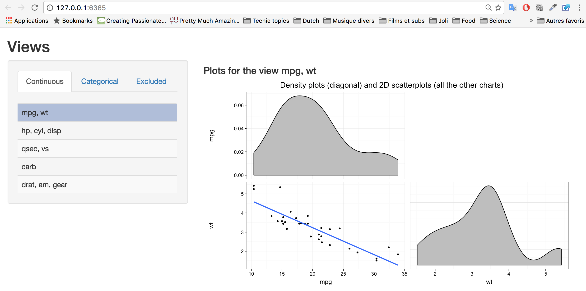
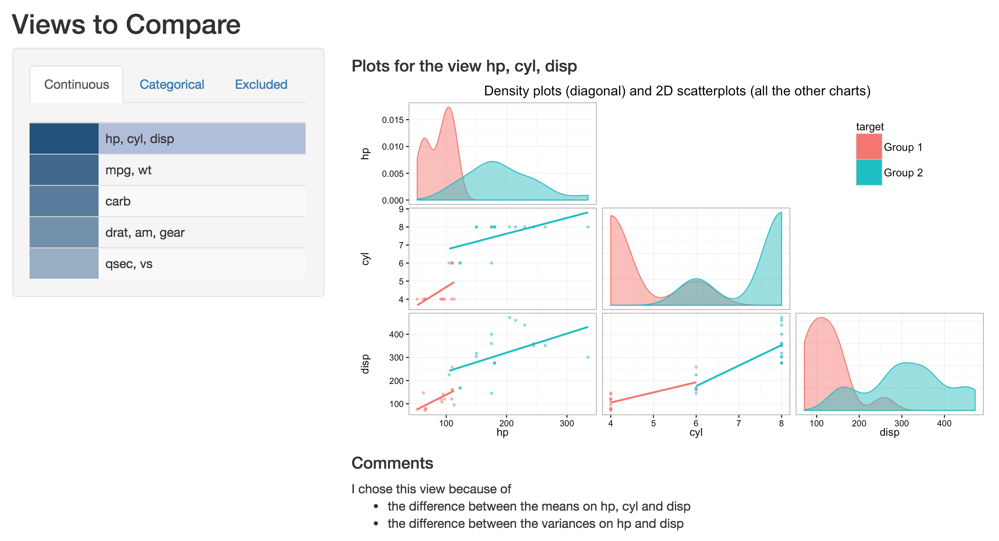
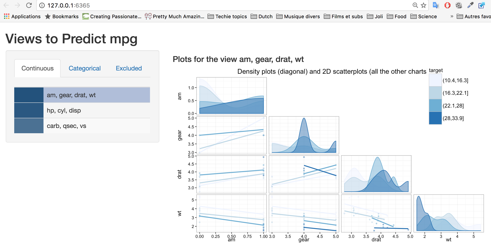

[](https://travis-ci.org/tsellam/findviews)

# findviews

The findviews package helps exploring wide data sets, by detecting, ranking and
plotting groups of statistically dependent columns. It relies heavily on
ggplot2 and shiny.

findviews is expecially useful to get quickly familiar with a new dataset. Load
your data in a data frame, call `findviews`, and you are ready to go.


## Installation

You may download findviews' latest release as follows:
```R
install.packages("findviews")
```

Alternatively, you may install the latest development version:
```R
devtools::install_github("tsellam/findviews")
```

## How to use it

### Overview

The findviews package is based on three functions:

* `findviews` detects and plots groups of dependent variables. This function
   is useful to explore new datasets.
* `findviews_to_compare` calls `findviews` and ranks the views by how well
   they separate two arbitrary subsets of the data. This function is useful 
   to compare groups - for instance "Young people" vs. "Old  people" in a survey dataset, or
   "Winners" vs. "Losers" for a sports use case.
* `findviews_to_predict` calls `findviews` and ranks the views by how well
   they predict an arbitrary variable. This function is useful to understand
   how one particular column is influenced by the other variables in the
   database - for instance, "Salary" in a census database.

The following sections describe these 3 functions in more detail.

### The main function: `findviews`

`findviews` is the most important function in the package. It takes a data
frame or a matrix as input, as well as a few optional parameters described in
its R documentation. It then performs the following operations:

1. It detects columns types and removes unpractical columns (e.g., primary keys or constants values).
2. It computes the statistical dependency between all the pairs of colums.
3. It detects clusters of dependent columns - that is, views.
4. It plots the views with ggplot2 and loads them in a Shiny app.

You may call `findviews` as follows: 

```R
findviews(mtcars)
```

As a result, R will start a browser and display the views.
<p align="center">

</p>

You can pick a view on the left panel and visualize it in the main panel.


### Ranking the views: `findviews_to_predict` and `findviews_to_compare`

The function `findviews` can generate views, but it cannot tell which ones to
look at. This where `findviews_to_predict` and `findviews_to_compare` come in. 
Those two functions generate views, exactly as `findviews` does (in
fact, they call `findviews` internally) but they also *rank* the results.

The function `findviews_to_compare` ranks views which highlight how two groups
of row *differ* from each other. Suppose for intance that we wish to compare
the rows for which `mpg > 20` and those for which `mpg < 20`. We call the
function as follows:

```R
findviews_to_compare(mtcars$mpg >= 20 , mtcars$mpg < 20 , mtcars)
```

The result is a set of views on which the two groups have different statistical
distributions:
<p align="center">

</p>


The aim of `findviews_to_predict` is to help users understand how a specific
column is influenced by the other columns in the database.  For instance,
suppose that we wish to understand what influences the variable `mpg` in the
`mtcars` data set. We would call `findviews_to_predict` as follows:

```R
findviews_to_predict('mpg', mtcars)
```

The result is a ranked set of views, as shown below.
<p align="center">

</p>

### `_core` functions

The functions `findviews`, `findviews_to_predict` and `findviews_to_compare`
present their results with Shiny. At times, this method can be heavy and we may
prefer to obtain the results directly as R objects (possibly to use them in a
more complex workflow). This is possible, with the `_core` functions.  The
functions `findviews_core`, `findviews_to_predict_core` and
`findviews_to_compare_core` operate exactly as their counterparts, but they
return their results as lists and data frames.


## WARNING

Beware: the recommendations of findviews must be taken with a huge grain of
salt.  Some of its views are absurd. They are artifacts of the algorithms, or
the system just "got lucky" and made totally spurious findings. Inversely,
*findviews will almost surely miss important aspects of the data*.

In summary, findviews is designed to help you get started with a data set and
give some inspiration. But *it cannot replace critical judgement*. In
fact, the best way to use it is to understand what it does. To this end, I
encourage you to read the functions' R documentation.

## Acknowledgements

This work is carried out at the Dutch center for mathematics and computer science (CWI). It is funded by the national project COMMIT.

